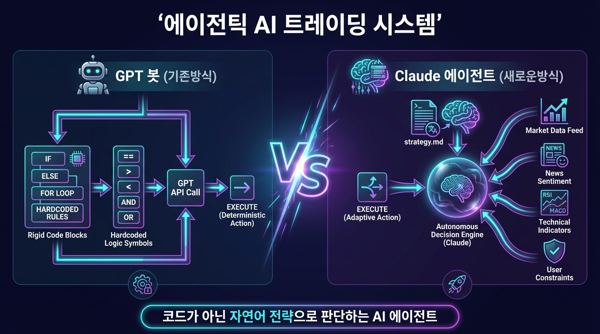
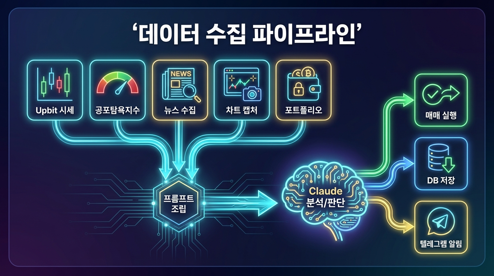
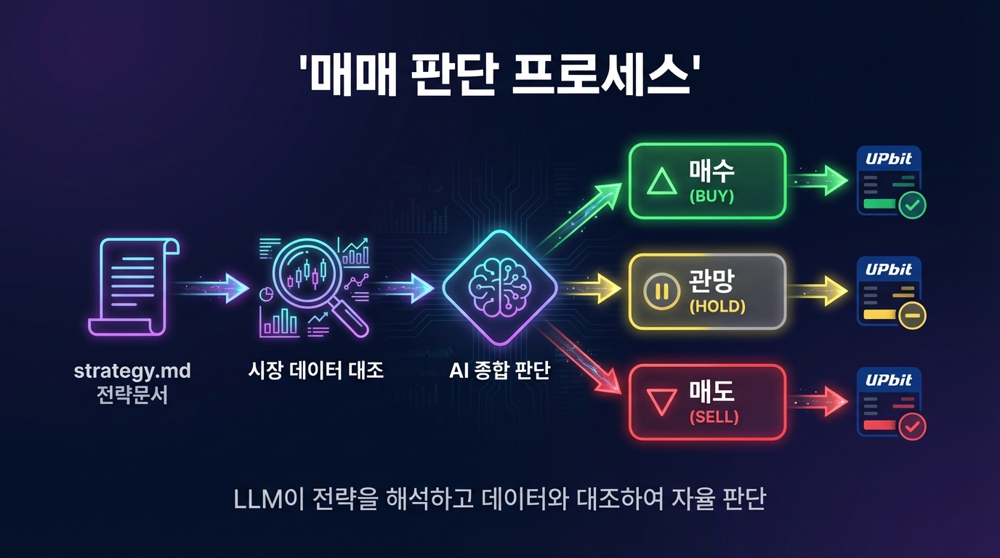
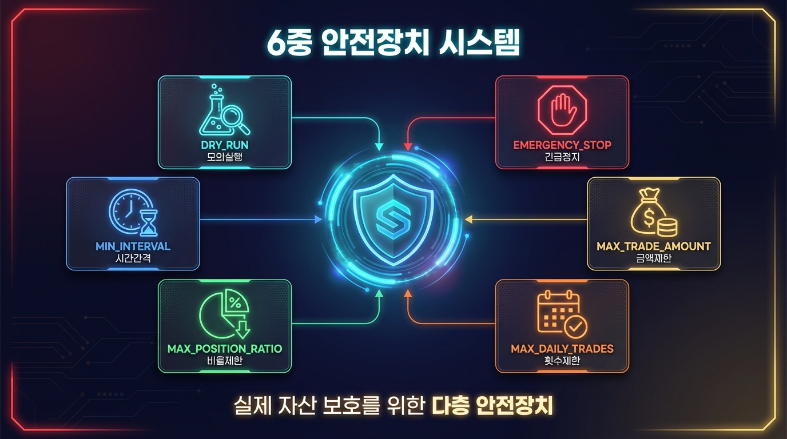
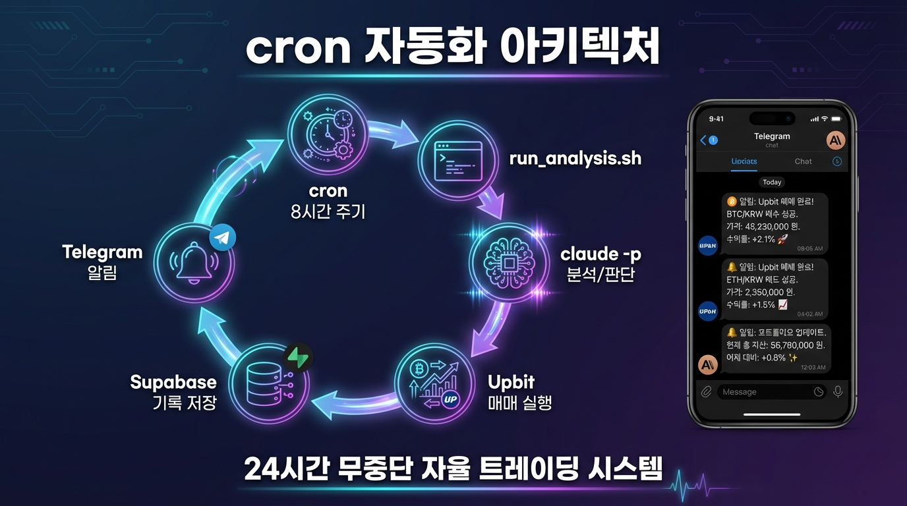

# Claude 암호화폐 자동매매 봇

> Claude Code가 직접 데이터를 수집하고, 분석하고, 판단하고, 매매까지 실행하는 AI 트레이딩 시스템

## 핵심 컨셉

기존 GPT 트레이딩 봇은 **"코드가 API를 호출 → GPT에게 판단을 물어보는"** 구조입니다.

이 프로젝트는 다릅니다. **"Claude가 전략 문서를 읽고, 스스로 데이터를 수집하고, 분석하고, 매매를 실행하는"** 에이전틱 구조입니다.



- 매매 로직을 코드로 하드코딩하지 않습니다
- `strategy.md`에 자연어로 전략을 작성하면 Claude가 해석하여 판단합니다
- Python 스크립트는 데이터 수집과 API 호출만 담당합니다

## 아키텍처





```
┌─────────────────────────────────────────────────────────┐
│                    cron (8시간 간격)                      │
│  setup_cron.sh → cron_run.sh → run_analysis.sh          │
└──────────────────────┬──────────────────────────────────┘
                       │ 데이터 수집
        ┌──────────────┼──────────────┐
        ▼              ▼              ▼
   Upbit API    Alternative.me   Tavily API
   (시세/호가)   (공포탐욕지수)    (뉴스)
        │              │              │
        └──────────────┼──────────────┘
                       ▼
              프롬프트 조립 (stdout)
                       │
                       ▼
               claude -p (분석/판단)
              ┌────────┼────────┐
              ▼        ▼        ▼
          strategy   과거결정   피드백
           .md      (Supabase)  (DB)
              │        │        │
              └────────┼────────┘
                       ▼
                 매수/매도/관망 결정
              ┌────────┼────────┐
              ▼        ▼        ▼
          Upbit     Supabase   Telegram
          (매매)    (기록)     (알림)
```

## 빠른 시작

### 원클릭 설치

```bash
bash <(curl -sL https://trading.dante-labs.com/coin/install.sh)
```

### 수동 설치

```bash
git clone https://github.com/dante-labs/claude-coin-trading.git
cd claude-coin-trading
python3 -m venv .venv && source .venv/bin/activate
pip install -r requirements.txt
cp .env.example .env  # API 키 설정
```

### API 키 발급

`.env` 파일에 아래 키를 설정하세요:

| 서비스 | 용도 | 발급 |
|--------|------|------|
| Upbit | 시세 조회 + 매매 실행 | [업비트 OpenAPI 관리](https://upbit.com/mypage/open_api_management) |
| Tavily | 뉴스 수집 | [tavily.com](https://tavily.com) |
| Supabase | 매매 기록 저장 | [supabase.com](https://supabase.com) |
| Telegram | 실행 결과 알림 | [@BotFather](https://t.me/BotFather) |

### 실행

```bash
# Claude Code 대화형 세션
cd claude-coin-trading && claude

# 첫 프롬프트
"비트코인 시장을 분석해줘"
```

## 교육 커리큘럼 (Step 0~12)

이 프로젝트는 Claude Code에 프롬프트를 하나씩 입력하면서 자동매매 시스템을 직접 구축하는 교육용 프로젝트입니다.

| Step | 프롬프트 | 결과물 |
|------|---------|--------|
| 0 | "환경을 세팅해줘" | Python venv, .env |
| 1 | "Upbit API로 시장 데이터를 수집해줘" | collect_market_data.py |
| 2 | "공포탐욕지수를 수집해줘" | collect_fear_greed.py |
| 3 | "BTC 뉴스를 수집해줘" | collect_news.py |
| 4 | "차트를 스크린샷으로 캡처해줘" | capture_chart.py |
| 5 | "포트폴리오 잔고를 조회해줘" | get_portfolio.py |
| 6 | "매매 전략을 작성해줘" | strategy.md |
| 7 | "매매 실행 스크립트를 만들어줘" | execute_trade.py |
| 8 | "텔레그램 알림을 만들어줘" | notify_telegram.py |
| 9 | "Supabase DB를 설계해줘" | 001_initial_schema.sql |
| 10 | "분석 파이프라인을 만들어줘" | run_analysis.sh |
| 11 | "비트코인 시장을 분석해줘" | 첫 분석 실행 |
| 12 | "cron 자동화를 설정해줘" | cron_run.sh, setup_cron.sh |

자세한 프롬프트는 `CLAUDE.md`의 교육 커리큘럼 섹션을 참고하세요.

## 프로젝트 구조

```
claude-coin-trading/
├── CLAUDE.md                      # 프로젝트 지침 (Claude가 읽는 파일)
├── strategy.md                    # 매매 전략 (자연어, Claude가 해석)
├── .env.example                   # API 키 템플릿
├── requirements.txt               # Python 의존성
├── setup.sh                       # 원클릭 설치 스크립트
├── scripts/
│   ├── collect_market_data.py     # Upbit 시세 + 기술지표
│   ├── collect_fear_greed.py      # 공포탐욕지수
│   ├── collect_news.py            # Tavily 뉴스
│   ├── capture_chart.py           # Playwright 차트 캡처
│   ├── execute_trade.py           # 매매 실행 (3중 안전장치)
│   ├── get_portfolio.py           # 포트폴리오 조회
│   ├── notify_telegram.py         # 텔레그램 알림
│   ├── run_analysis.sh            # 분석 파이프라인
│   ├── cron_run.sh                # cron 실행 래퍼
│   └── setup_cron.sh              # cron 등록 도우미
├── .claude/skills/                # 6개 Claude 스킬
│   ├── crypto-trader/             # 메인 오케스트레이션
│   ├── upbit-api/                 # Upbit REST API
│   ├── fear-greed-index/          # 공포탐욕지수
│   ├── tavily-news/               # 뉴스 수집
│   ├── chart-capture/             # 차트 캡처
│   └── trade-notifier/            # 텔레그램 알림
├── supabase/migrations/           # DB 스키마
└── prompts/schemas/               # JSON 스키마
```

## 안전장치



**실제 자산을 거래할 수 있는 시스템입니다.** 반드시 아래 안전장치를 확인하세요.

| 파라미터 | 기본값 | 설명 |
|---------|--------|------|
| `DRY_RUN` | `true` | 분석만 수행, 실제 매매 없음 |
| `MAX_TRADE_AMOUNT` | `100000` | 1회 매매 상한 (KRW) |
| `MAX_DAILY_TRADES` | `3` | 일일 매매 횟수 상한 |
| `MAX_POSITION_RATIO` | `0.5` | 총 자산 대비 최대 투자 비율 |
| `EMERGENCY_STOP` | `false` | `true` 시 모든 매매 즉시 중지 |

> **DRY_RUN=true 상태에서 충분히 테스트한 후 실전 전환하세요.**

## 실행 모드

### 1. 대화형 모드 (개발/관리)

```bash
claude
```

```
"현재 포트폴리오 보여줘"
"전략에서 RSI 조건을 25로 바꿔줘"
"긴급 정지해줘"
```

### 2. 자동 실행 모드 (cron)



```bash
# cron 등록 (대화형 간격 선택)
bash scripts/setup_cron.sh install

# 상태 확인
bash scripts/setup_cron.sh status

# 해제
bash scripts/setup_cron.sh remove
```

## 기술 스택

| 구분 | 기술 |
|------|------|
| AI 엔진 | Claude Code (`claude -p`) |
| 거래소 | Upbit REST API (JWT 인증) |
| 시장 심리 | Alternative.me Fear & Greed Index |
| 뉴스 | Tavily Search API |
| 차트 | Playwright (headless Chromium) |
| 데이터베이스 | Supabase (PostgreSQL) |
| 알림 | Telegram Bot API |
| 자동화 | cron + shell pipeline |

## 면책 조항

이 프로젝트는 **교육 목적**으로 제작되었습니다. 암호화폐 투자는 원금 손실의 위험이 있으며, 이 시스템의 사용으로 발생하는 모든 손익에 대한 책임은 사용자 본인에게 있습니다. 반드시 `DRY_RUN=true`로 충분히 테스트한 후 소액으로 시작하세요.

## License

MIT

---

## About Dante Labs

AI 자동화, 에이전틱 AI, 데이터사이언스, No-code 도구 활용을 전문으로 하는 교육 채널입니다.

[](https://youtube.com/@dante-labs)
[](https://discord.com/invite/rXyy5e9ujs)
[](https://dante-labs.com)
[](https://open.kakao.com/o/gURfTmqh)

### Support

이 프로젝트가 도움이 되셨다면 커피 한 잔 후원으로 응원해주세요!

[](https://buymeacoffee.com/dante.labs)
